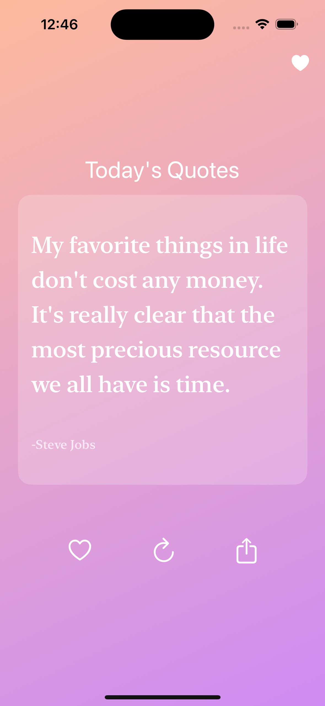
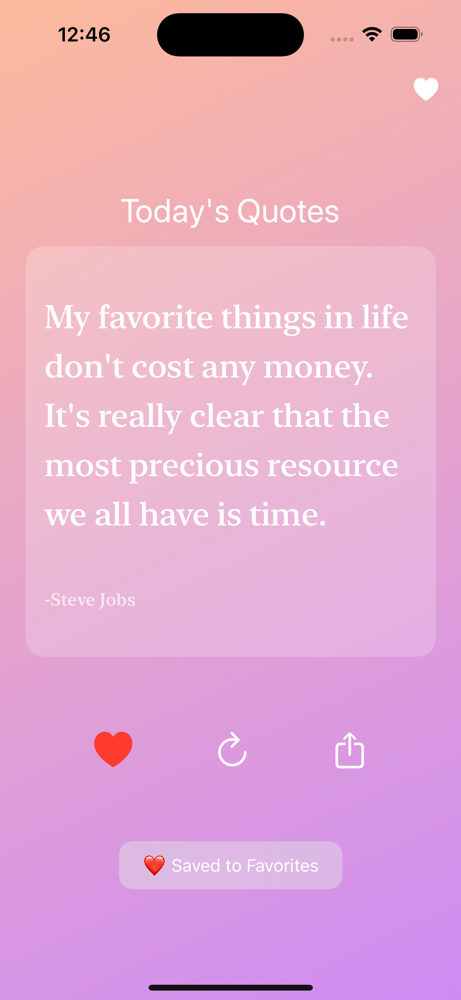
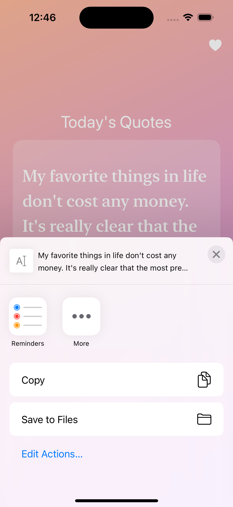
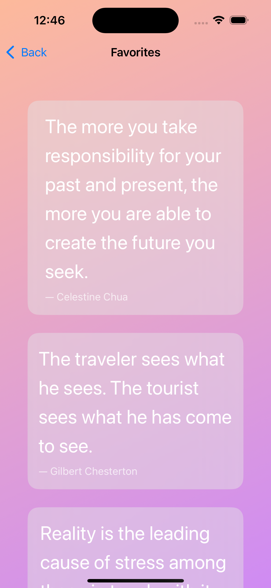

# ✨ DailyMotiv – Daily Quote App for iOS

DailyMotiv is a minimalist, beautifully styled iOS app that delivers daily inspiration. Designed with SwiftUI, it offers motivational quotes, lets you save your favorites, and share positivity — all with a calming gradient interface.

---

## ✨ Features

- 📜 **Quote of the Day**: Get inspired with a new motivational quote
- ❤️ **Favorites**: Save quotes you love and revisit them anytime
- 🔄 **Refresh Quotes**: Pull up new quotes with one tap
- 📤 **Share Anywhere**: Send quotes to friends or post to social media
- 📋 **Copy Support**: Easily copy quotes to your clipboard
- 🌈 **Elegant Gradient UI**: Calming, modern background transitions
- 🌙 **Dark Mode**: Fully supported

---

## 📸 Screenshots

### 🧘 Quote of the Day


### ❤️ Saved to Favorites


### 📤 Share Options


### ⭐ Favorites View


---

## 📦 Getting Started

To run DailyMotiv locally:

1. **Clone the repo**
   ```bash
   git clone https://github.com/yourusername/DailyMotiv.git
2. cd DailyMotiv
   open DailyMotiv.xcodeproj
3. Build and Run
   -Select an iPhone simulator
   -Press Cmd + R or hit ▶️ in Xcode

🛠 Requires Xcode 15+ and iOS 16+
